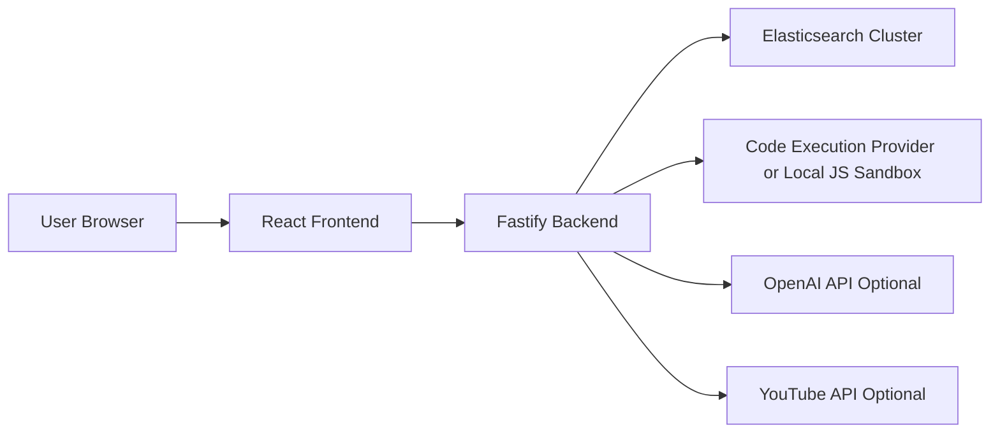

# Melete

A full-stack, production-minded learning platform that combines guided learning, coding practice, and career navigation in one workspace.

Melete is built for students and early-career engineers who need more than a course catalog. It is designed as an execution system: discover the right path, practice under realistic constraints, and measure progress continuously.

## Why Melete Exists

Most learning products optimize for content volume. Melete optimizes for outcomes:

- learn by track and mission, not random playlists
- practice in a coding workspace with run/submit feedback loops
- convert activity into signals (gaps, strengths, momentum)
- search across all learning assets with relevance and speed

## What You Get

- Personalized mission and track navigation
- Practice workspace with runtime execution + submissions
- Unified search across Problems, Tracks, Courses, Roadmaps, Help Docs
- Company roadmap intelligence for internship/FTE readiness
- AI coach surfaces (when OpenAI key is configured)
- Tech updates and curated event discovery

## System Snapshot

| Layer | Stack |
|---|---|
| Frontend | React 18, TypeScript, Vite, Tailwind, shadcn/ui, React Query |
| Backend | Fastify + TypeScript, Zod, in-memory/Redis cache |
| Search | Elasticsearch (primary) + local in-memory fallback |
| Practice Runtime | Provider-compatible execution client + local JS sandbox fallback |
| Infra | Docker Compose (frontend, backend, elasticsearch) |

## Architecture



See detailed design in [Architecture](./docs/ARCHITECTURE.md).

## Repository Layout

```text
.
├── src/                       # Frontend app (pages, components, services)
│   ├── components/            # Reusable UI + feature components
│   ├── pages/                 # Route-level screens
│   ├── services/              # API clients and client-side engines
│   ├── data/                  # Local datasets and seeded metadata
│   └── shared/                # Shared ranking/search utilities
├── server/                    # Fastify backend and integrations
├── public/                    # Static assets (logos, icons)
├── docker/                    # Nginx runtime config
├── deploy/cloudrun/           # Cloud Run deployment scripts
├── career_intelligence_engine/# Optional Python intelligence service
└── docs/                      # Submission docs and operational guides
```

Full map: [Project Structure](./docs/PROJECT_STRUCTURE.md)

## Quick Start

### 1) Install

```bash
npm install
```

### 2) Run locally (split mode)

Terminal A:

```bash
npm run server:dev
```

Terminal B:

```bash
npm run dev
```

- Frontend: <http://localhost:8080>
- Backend health: <http://127.0.0.1:4000/healthz>

### 3) Run with Docker (recommended)

```bash
npm run docker:up
```

- Frontend: <http://localhost:8090>
- Backend: <http://localhost:4000>
- Elasticsearch: <http://localhost:9200>

Stop:

```bash
npm run docker:down
```

## Core Endpoints

### Platform Health

- `GET /healthz`
- `GET /readyz`
- `GET /metrics`

### Unified Search

- `GET /search?q=...`
- `GET /search/autocomplete?q=...`
- `POST /search/reindex`
- `POST /search/engagement`

### Practice Runtime

- `GET /api/code/languages`
- `POST /api/code/execute`
- `POST /api/code/submissions`
- `GET /api/code/submissions`

See endpoint details in [Runbook](./docs/RUNBOOK.md).

## Environment Configuration

Template files:

- `.env.backend.example`
- `.env.frontend.example`
- `.env.docker.example`

Important variables:

- `SEARCH_BACKEND`
- `ELASTICSEARCH_URL`
- `ELASTICSEARCH_INDEX`
- `ELASTICSEARCH_UNIFIED_INDEX`
- `CODE_EXEC_PROVIDER`
- `CODE_EXEC_API_URL`
- `CODE_EXEC_ENABLE_FALLBACK`
- `OPENAI_API_KEY` (optional)
- `YOUTUBE_API_KEY` (optional)

## Quality Checks

```bash
npm test
npm run build
```

## Submission Notes

For evaluators and maintainers:

- [Documentation Hub](./docs/README.md)
- [Submission Overview](./docs/SUBMISSION.md)
- [Project Structure](./docs/PROJECT_STRUCTURE.md)
- [Architecture](./docs/ARCHITECTURE.md)
- [Operations Runbook](./docs/RUNBOOK.md)

---

If you are reviewing this repository for deployment or evaluation, start with [Submission Overview](./docs/SUBMISSION.md).
